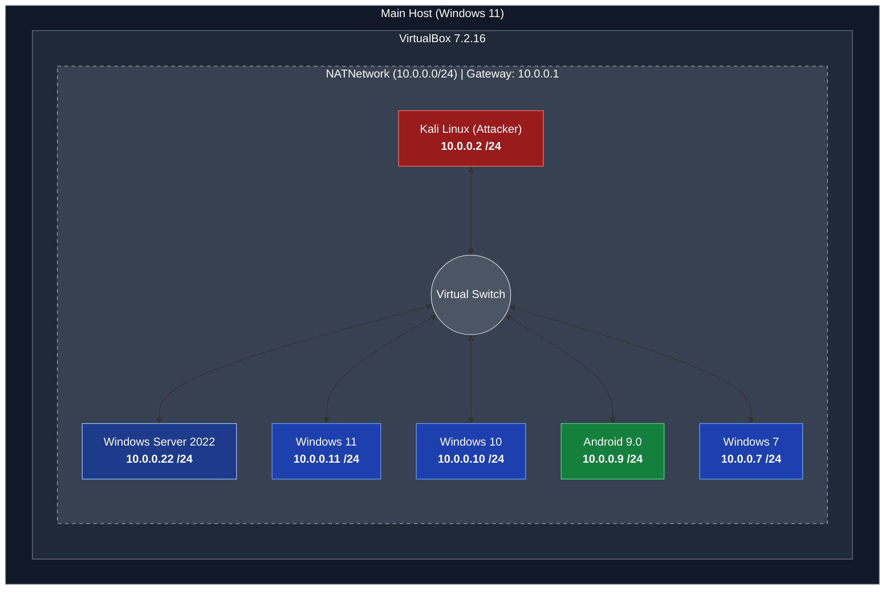

# Cybersecurity Lab Setup Report — Week 1 (WK1-PM1)

**Created By:** Christ Evvert Lisangan  
**Module:** WK1-PM1 - Lab Setup VirtualBox and Kali Linux  
**Date:** September 8, 2026  

---

## 1. Summary

This report documents the implementation and verification of a lab environment built using Oracle VirtualBox and Kali Linux as specified in module WK1-PM1[cite: 2]. The laboratory utilizes an isolated virtual subnet (`10.0.0.0/24`) configured with NATNetwork, allowing the attacker machine full outbound Internet accessibility while providing network communication across target virtual machines[cite: 2].

---

## 2. Environment Specifications

| Component | Configuration Parameter | Setting / Value |
| :--- | :--- | :--- |
| **Host System** | Base OS | Windows 11 (Host)[cite: 2] |
| **Hypervisor** | Virtualization Platform | Oracle VirtualBox v7.2.16[cite: 2] |
| **Network Type** | Virtual Adapter Mode | NATNetwork (`CSInternNetwork`)[cite: 2] |
| **Subnet Scope** | IPv4 Network Address | `10.0.0.0/24`[cite: 2] |
| **DHCP Scope** | Automatic Address Allocation | `10.0.0.2` to `10.0.0.99 /24` *(Configured statically)*[cite: 2] |
| **Attacker Machine** | Operating System | Kali Linux 2026.2 (64-bit)[cite: 2] |
| **Kali Network** | Static IPv4 Address | `10.0.0.2 /24`[cite: 2] |
| **Kali Routing** | Default Gateway | `10.0.0.1`[cite: 2] |
| **DNS Resolution** | Primary DNS Server | `8.8.8.8`[cite: 2] |

---

## 3. Network Architecture Topology



---

## 4. Step-by-Step Configuration Procedures

### Phase 1: VirtualBox Global Network Configuration

1. Navigated to **VirtualBox Manager > Tools > Network > NAT Networks**.


2. Created a new NAT Network named **`CSInternNetwork`**.


3. Configured the IPv4 Prefix to **`10.0.0.0/24`** and enabled DHCP Server.


### Phase 2: Kali Linux VM Network Setup

1. Opened Kali Linux VM **Settings > Network > Adapter 1**.


2. Attached the adapter to **NAT Network** and selected **`CSInternNetwork`**.


3. Set Promiscuous Mode to **Allow All**. This setting allows the virtual NIC to accept all packets visible on the virtual switch, including inter-VM traffic, host traffic, and spoofed frames.


---

## 5. Verification & Testing

### Verification Commands

Executed from the Kali Linux terminal to verify Internet connectivity and local host reachability:

```bash
# Test public Internet reachability
ping google.com

# Test connectivity to internal lab hosts
ping 10.0.0.9   # Android OS
ping 10.0.0.10  # Windows 10 Target VM

```

---

## 6. Screenshots & Evidence

### Screenshot 1: VirtualBox NAT Network Configuration (10.0.0.0/24)


### Screenshot 2: Kali Linux Network Settings & Static IP (10.0.0.2)


### Screenshot 3: Terminal Ping Test & Internet Connectivity Verification


### Screenshot 4: Terminal Ping Test to Android OS (10.0.0.9)


### Screenshot 5: Terminal Ping Test & Firewall Troubleshooting (Windows 10)


Initial test resulted in 100% packet loss due to Windows Defender Firewall dropping ICMP requests. By disabling the Windows Defender Firewall, the issue was resolved ping is successful.

```

```
